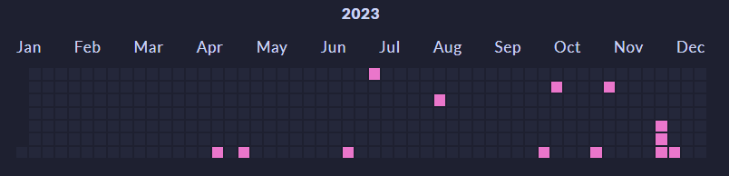

# Posts graph for Hugo

Generate a data file to create a post graph from posts.

## Usage

Installation

```bash
# Hugo by default dont need NPM
npm init
npm i @themaymeow/rpo-api-client
```

Using in your script

```javascript
import stats from "@themaymeow/hugo-posts-graph/hugo.js";
stats.getDates("content/posts")
```
The script above will create a new file `data/postGraph.json` that you can use to create the graph.

## Using with Hugo

To display the result on your page, you need to implement a new layout or shortcode. I have made examples of both sortcode and style.
You are free to make your own, but if you want to start right now:

- Add [posts-graph-shortcode.html](https://github.com/MayMeow/hugo-posts-graph/blob/main/example/posts-graph-shortcode.html) to your shortcode folder
- And [_posts-graph.scss](https://github.com/MayMeow/hugo-posts-graph/blob/main/example/_posts-graph.scss) somewhere in your style.

Note that you will need to use hugo extended version to generate CSS from SCSS files.

Create a new page e.g.: `hugo new stats.md` and put following code somewhere in the content of your page.

```html

```

The result:



